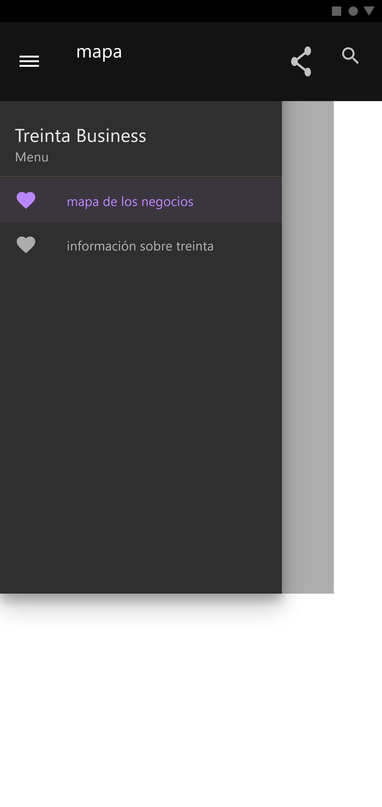
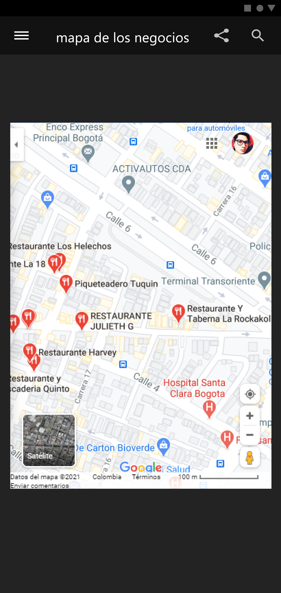
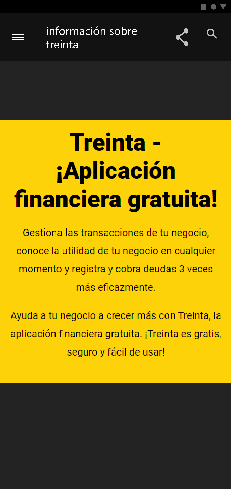

<p align="center">
  <a aria-label="SDK version" href="https://www.npmjs.com/package/expo" target="_blank">
    
  </a>
  <a aria-label="expo SDK version" href="https://docs.expo.io/versions/latest/" target="_blank">
    
  </a>
  <a aria-label="expo SDK version" href="https://reactnative.dev/docs/components-and-apis" target="_blank">
    
  </a>
</p>

# React Native DEVELOPER

Se solicita realizar la prueba de acuerdo al tiempo acordado.
Debe realizar una app para Android en React Native que permita visualizar los negocios
existentes en la ciudad de Bogotá. La aplicación debe contar con un respectivo login y registro,
además una sección en la que se hable sobre Treinta y de los múltiples beneficios de usar
Treinta.

Requerimientos:

1. ### Previo al desarrollo, debe realizar un diseño del aplicativo. Use su herramienta de preferencia Adobe XD, Figma, Zeplin, etc.
2. ### Realice las secciones mencionadas anteriormente (login, registro, información sobre Treinta, mapa de los negocios).
3. ### Para las secciones de login/registro utilice su herramienta de autenticación de preferencia (Auth0, firebase, etc)
4. ### En la sección de información de treinta puede reutilizar los recursos y textos dados en la web oficial de treinta.
5. ### Para el mapa de negocios, implementa el API de google maps para generar un mapa y ubique en el mismo al menos 25 ubicaciones aleatorias en la ciudad de Bogotá. Es un plus si se personaliza el mapa (colores, iconos de las etiquetas de ubicación, etc) y si genera persistencia de cualquier tipo para consumir y almacenar las ubicaciones

##  diseño del aplicativo

. | . | .
------------ | ------------- | ------------- 
intro | login  | registro
menu | mapa | info


# 💙 Empezar

## Instalar Expo CLI
```
npm install --global expo-cli
```
Verifique que la instalación se haya realizado correctamente ejecutando expo whoami. Aún no ha iniciado sesión, por lo que verá "No iniciado sesión". Puede crear una cuenta ejecutando expo register si lo desea, o si ya tiene un inicio de sesión para expo, pero tampoco necesita una cuenta para comenzar.

## Aplicación cliente Expo para iOS y Android
La forma más rápida de empezar a trabajar es utilizar la aplicación cliente Expo en su dispositivo iOS o Android. El cliente de Expo le permite abrir aplicaciones que se sirven a través de Expo CLI.

- 🤖 Android Play Store: Android Lollipop (5) y superior. [Playstore](https://play.google.com/store/apps/details?id=host.exp.exponent&hl=es_PR)
- 🍎 App Store de iOS: iOS 10 y superior. [App store](https://play.google.com/store/apps/details?id=host.exp.exponent&hl=es_PR)

Cuando el cliente de Expo haya terminado de instalarse, ábralo. Si creó una cuenta con expo-cli, puede iniciar sesión aquí en la pestaña "Perfil". Esto le facilitará la apertura de proyectos en el cliente cuando los tenga abiertos en desarrollo; aparecerán automáticamente en la pestaña "Proyectos" de la aplicación cliente.

## instale las dependencias requeridas

instale los paquetes requeridos para ejecutar el proyecto

```
npm install
```

# Correr En Ambiente "Development"

```
expo start
```

## Abrir la aplicación en su teléfono / tableta
```
👨‍👩‍👧‍👧
Puede abrir el proyecto en varios dispositivos simultáneamente. Pruébelo en un teléfono iPhone y Android al mismo tiempo si tiene ambos a mano.
```
- 🍎 En su iPhone o iPad, abra la aplicación "Cámara" de Apple predeterminada y escanee el código QR que ve en la terminal o en Expo Dev Tools.

- 🤖 En su dispositivo Android, presione "Escanear código QR" en la pestaña "Proyectos" de la aplicación cliente de Expo y escanee el código QR que ve en la terminal o en Expo Dev Tools.

# Exportar APK Android

Run:

```
expo build:android
```

## Tecnologias usadas

1. React Native y React.js
2. node.js
3. expo  (conjunto de herramientas, librerías y servicios los cuales te permiten desarrollar apps nativas)
4. servicios nube aws ( api gateway, lambda ), se diseño una funcion lambda para retornar la lista de negocios y se conecto por un api gateway de aws con metodo GET.
5. api google maps ( maps sdk android )
6. Adobe XD ( diseño aplicativo inicial)

## Autor

* **ANDRES DAVID VASQUEZ IBAÑEZ** - *Initial work* - [VASHIGO](https://github.com/vashigo)

## Licencia

Este proyecto tiene la licencia GNU General Public License; consulte el [LICENSE](LICENSE) archivo para detalles.